# Unofficial Object Pascal Logos
When I was given owner privileges to the repo behind [1brc.dev](https://1brc.dev) after asking to be included in the list, I found myself in a dilemma: I had no Object Pascal logos to use.

I then asked the wider Object Pascal community if they could help by proposing some ideas.

This repository will contains those proposals and in a not so far future we, the wider Object Pascal community, will vote on which one we will use. In due time I'll setup a poll for us to do so.

## Proposals
These are the proposal that I've collected so far.
### Handoko
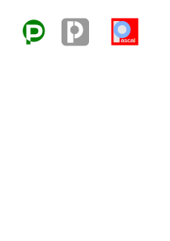
### IKelaiah
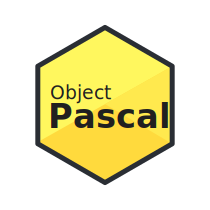
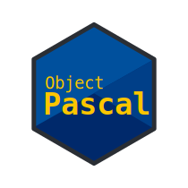
### Marion
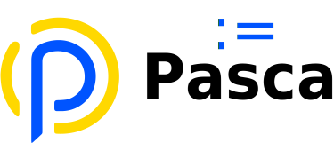
### Mobius1
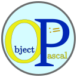

### Overanalytcl
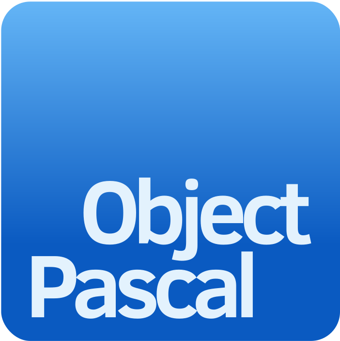
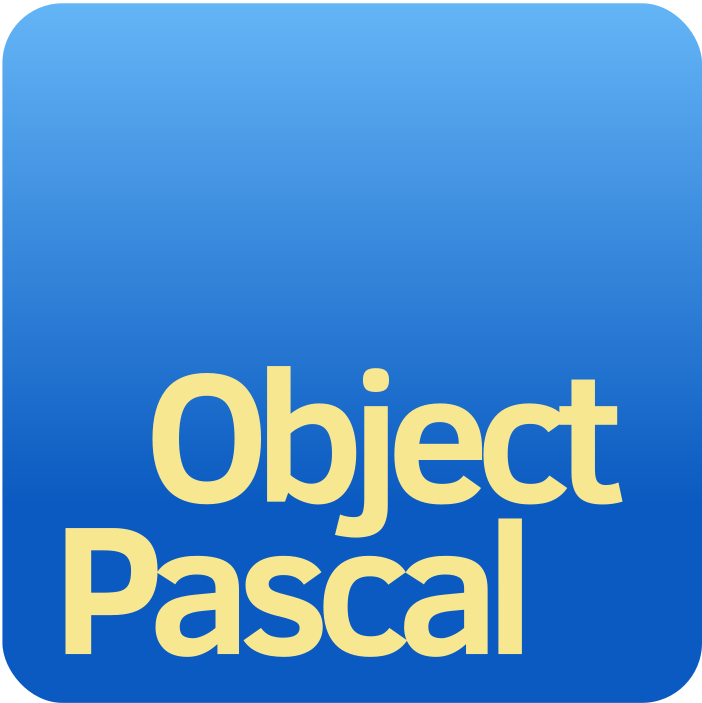
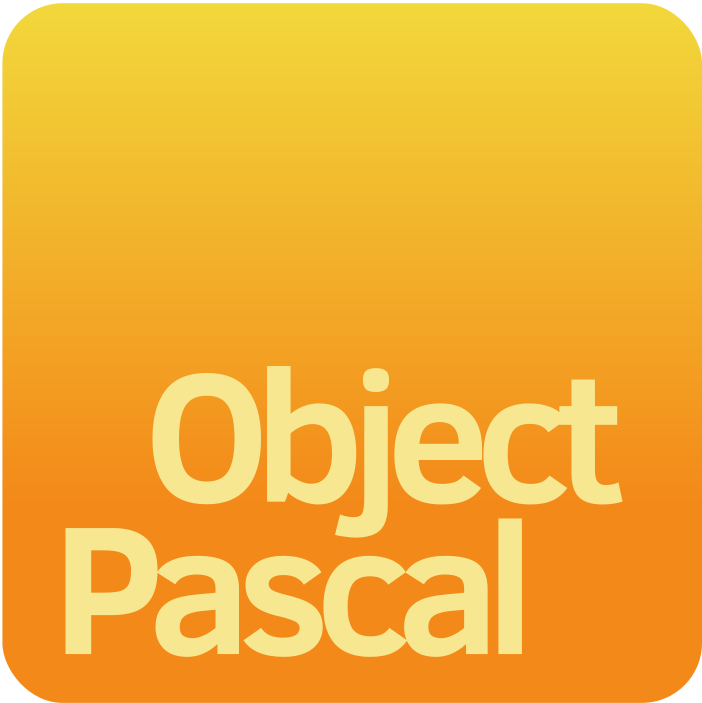
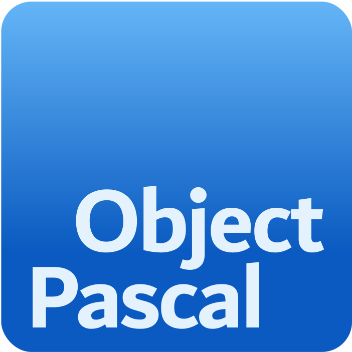
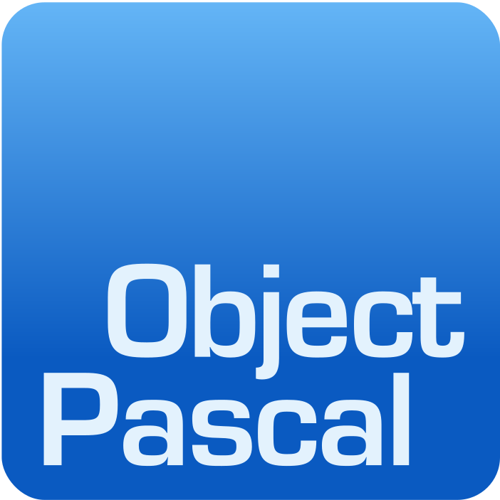
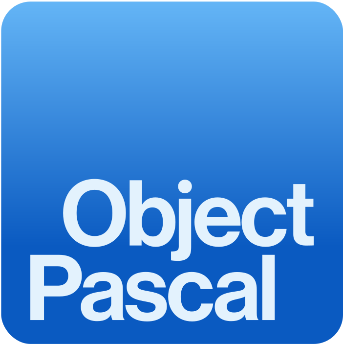
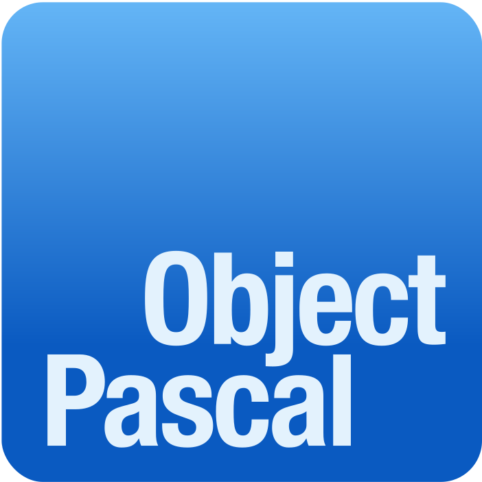
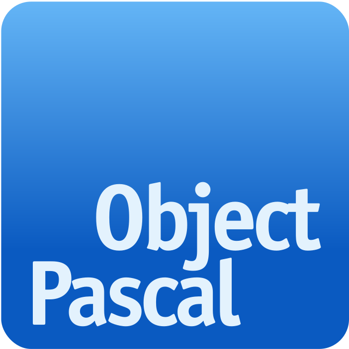
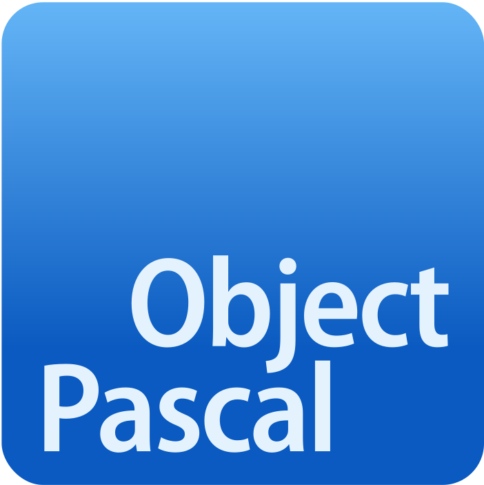
### Paweld
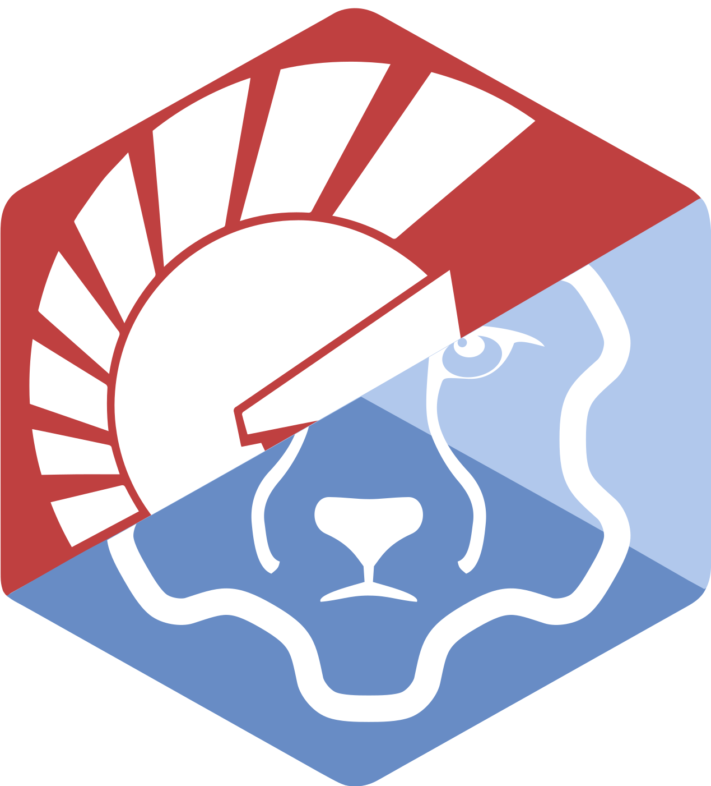

